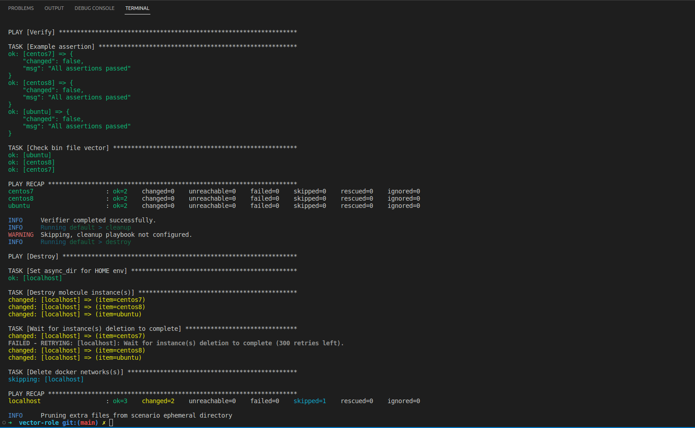
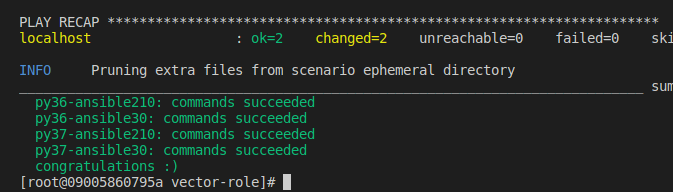

# Домашнее задание к занятию 5 «Тестирование roles»

## Molecule: 

Проверка наличия бинарного файла vector (проверяет код ответа, при получении ненулевого кода выхода - failed)

**Verify.yml**:

```yml
- name: Verify
  hosts: all
  gather_facts: false
  tasks:
    - name: Example assertion
      ansible.builtin.assert:
        that: true
    - name: Check bin file vector
      ansible.builtin.command: ls /usr/bin/vector
      register: result
      failed_when:
        - result.rc != 0
      changed_when: False
```
Проверка выполнения:



## Tox


